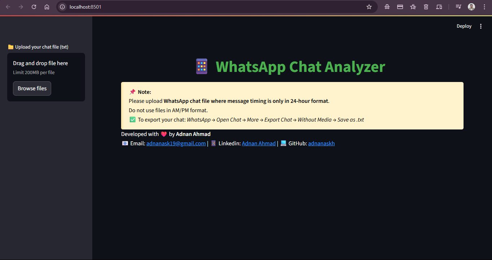
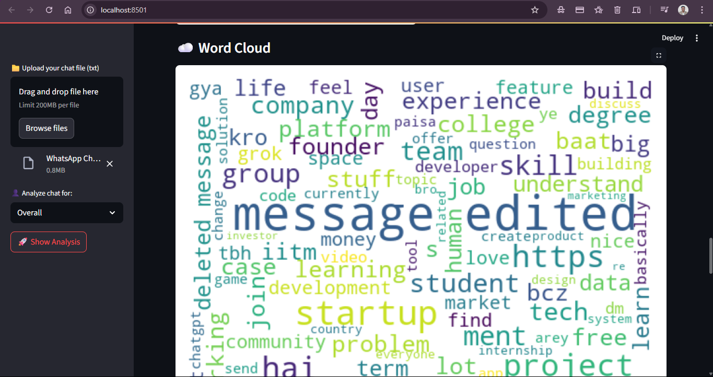
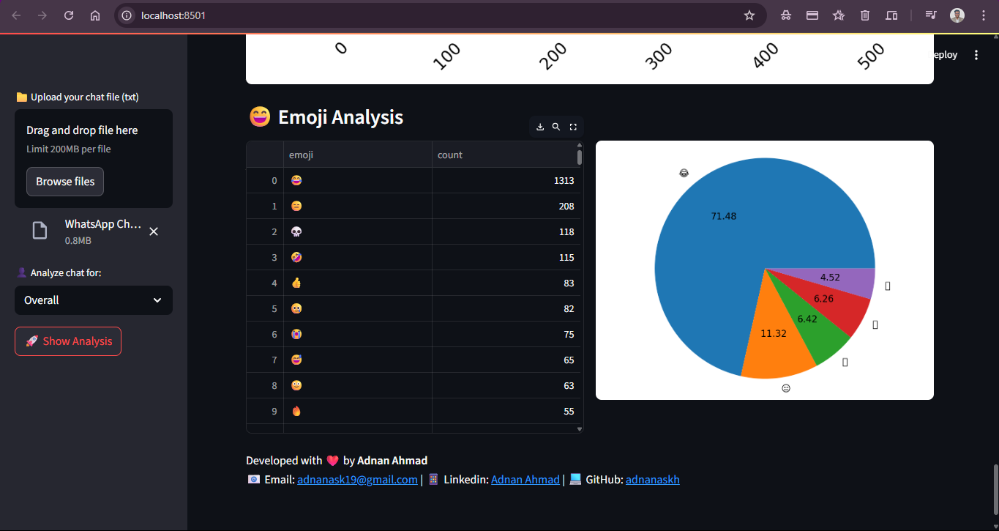

<h1 align="center">💬 WhatsApp Chat Analyzer</h1>

<p align="center">
  A sleek Streamlit-based app that turns your boring WhatsApp chats into beautiful visual insights ✨
</p>

<p align="center">
  
  
  
</p>

---

## 🧠 Project Overview

Live Demo here -->  

`WhatsApp Chat Analyzer` is a lightweight web-based tool that lets you upload `.txt` exports of your WhatsApp chats and gives back **stunning visual reports**, including:
- 📊 Message & Word Frequencies
- 🕒 Activity Heatmaps
- 🤖 Emoji Distribution
- 🧑‍🤝‍🧑 Most Active Participants
- ☁️ Word Clouds and more...

---

## ✨ Features

- ✅ Clean, responsive UI powered by Streamlit
- 📈 Matplotlib + Seaborn visualizations
- 🌈 Emoji usage graphs
- 📅 Timeline and activity maps
- 🧾 Preprocessing for raw WhatsApp `.txt` files
- 📤 Export options for charts and stats

---

## 🛠️ Tech Stack

| Layer         | Technologies                      |
| ------------- | --------------------------------- |
| 💻 Frontend   | Streamlit                         |
| ⚙️ Backend    | Python, Pandas, Regex             |
| 📊 Data Viz   | Matplotlib, Seaborn, WordCloud    |
| 🔤 Text Tools | Emoji, NLP preprocessing          |

---

## 🚀 Installation & Running Locally

```bash
# Clone the repo
git clone https://github.com/your-username/whatsapp-chat-analyzer.git

# Change directory
cd whatsapp-chat-analyzer

# Install dependencies
pip install -r requirements.txt

# Run the app
streamlit run app.py
````

> 💡 *Make sure your exported WhatsApp chat is in `.txt` format.*

---

## 📸 Screenshots

| Dashboard                         | Word Cloud                          | Emoji Pie                       |
|-----------------------------------|-------------------------------------|---------------------------------|
|  |  |  |

---

## 📁 File Structure

```
├── app.py                # Main Streamlit app
├── preprocessor.py       # Data cleaning and formatting
├── helper.py             # Analytics logic and visualizations
├── requirements.txt      # Dependencies
├── README.md             # This file!
└── assets/               # Screenshots, styles, icons
```

---

## 👨‍💻 Developer Notes

* Built with ❤️ using Python and lots of caffeine ☕
* Designed to help people get insights into their personal or group chat patterns
* Ideal for portfolio and data visualization practice

---

## 🙌 Acknowledgements

* Special thanks to [Streamlit](https://streamlit.io/)
* Emoji handling powered by [`emoji`](https://pypi.org/project/emoji/)
* Inspired by real-world WhatsApp data curiosity

---

## 📬 Contact & Credits

Developed with 💚 by **Adnan Ahmad**

* 📧 Email: [adnanask19@gmail.com](mailto:adnanask19@gmail.com)
* 🔗 LinkedIn: [linkedin.com/in/aaskmee](https://linkedin.com/in/aaskmee)
* 🐙 GitHub: [github.com/adnan-ahmad](https://github.com/adnanaskh)

---

> ⚡ *“Data speaks louder when visualized beautifully.”*


